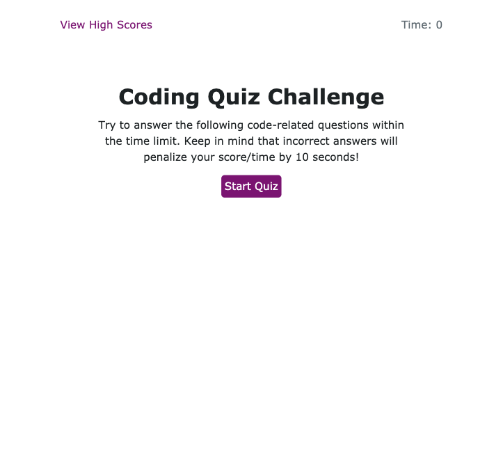

# code-quiz

## Table of contents
* [General info](#general-info)
* [Technologies](#technologies)
* [Authors](#authors)
* [Link to Page](#link-to-page)

## General info
A timed quiz on JavaScript fundamentals that stores high scores
that gauges progress compared to others

    
## Technologies
This app runs in the browser and features dynamically updated with: 

* HTML
* CSS
* JavaScript using JSON & local storage
    

## Authors

* **Karla McLeod** - *Initial work* - [Kmcleod81](https://github.com/Kmcleod81)

## Link to Page

* https://kmcleod81.github.io/code-quiz/
